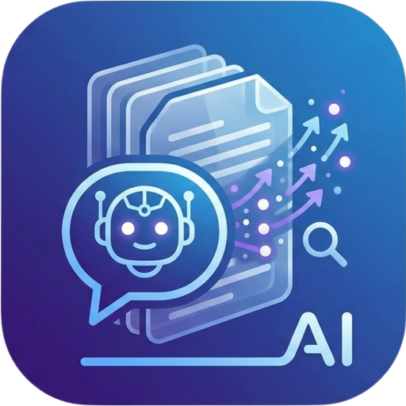
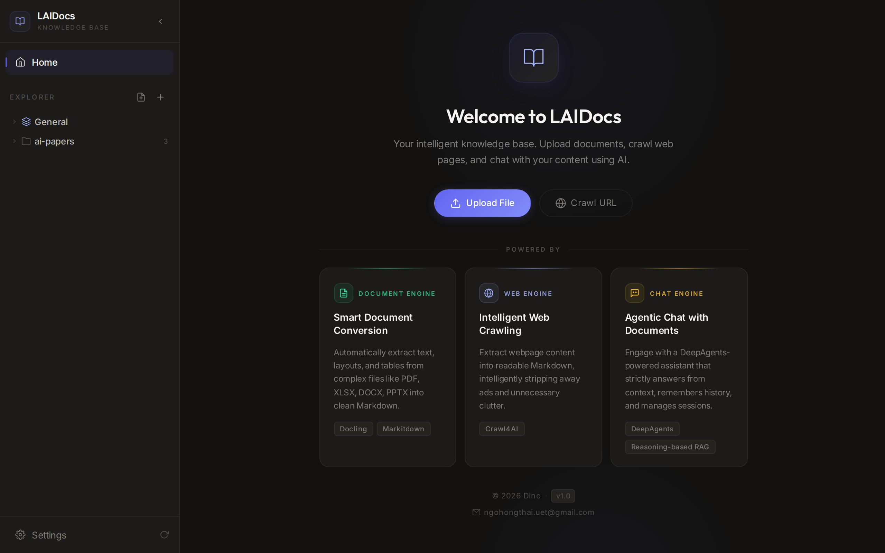
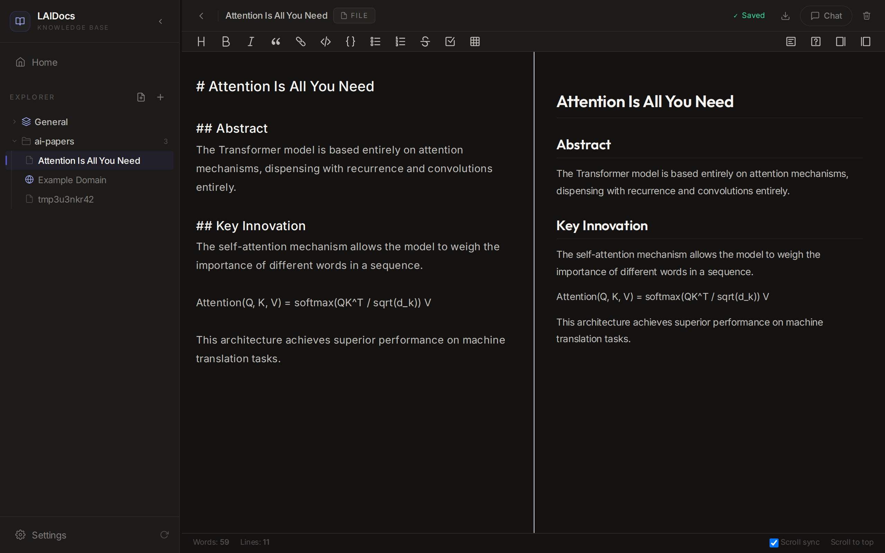
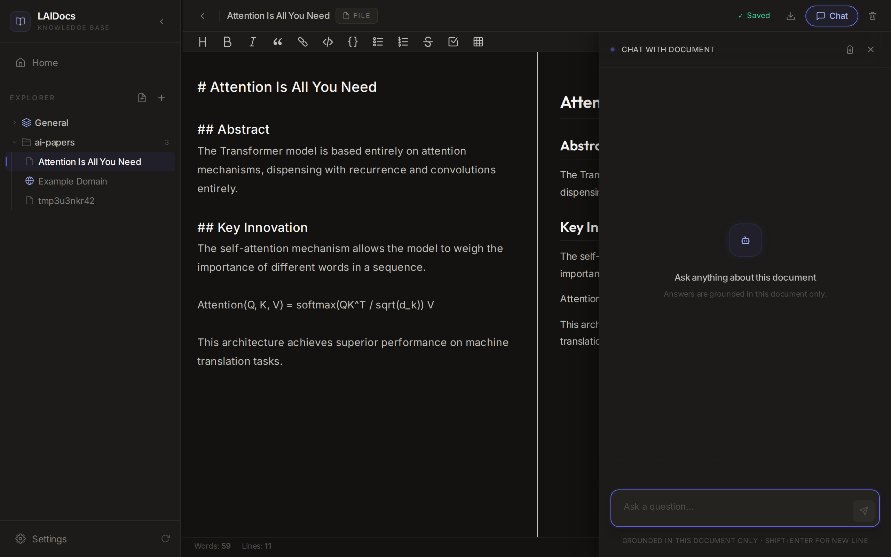

<p align="center">
  
</p>

<h1 align="center">LAIDocs</h1>

<p align="center">
  <strong>Local AI Document Manager</strong><br>
  Convert documents & URLs to Markdown, organize in folders, and chat with your content — all 100% local.
</p>

<p align="center">
  <a href="https://github.com/dino-research/laidocs/releases"></a>
  <a href="https://github.com/dino-research/laidocs/blob/main/LICENSE"></a>
  
  
  
  
</p>

<p align="center">
  <a href="#features">Features</a> • <a href="#screenshots">Screenshots</a> • <a href="#getting-started">Getting Started</a> • <a href="#architecture">Architecture</a> • <a href="#contributing">Contributing</a>
</p>

---

## Why LAIDocs?

Most AI document tools send your files to the cloud. **LAIDocs doesn't.**

Your documents stay on your machine. The only external connection is to the LLM API you configure — and you can use a fully local model (Ollama, LM Studio) for zero data leaving your machine.

> **Privacy-first. No data leaves your machine. No tracking. No cloud dependency.**

---

## Features

### 📄 Smart Document Conversion
- **PDF, DOCX, PPTX, XLSX, HTML** → clean Markdown via [Docling](https://github.com/DS4SD/docling)
- **Image extraction** — embedded images saved as vault assets with Markdown references
- **LLM refinement** — optional OCR noise cleanup via your configured LLM
- **VLM descriptions** — optional image descriptions for scanned PDFs

### 🌐 Web Crawling
- URL → Markdown via [Crawl4AI](https://github.com/unclecode/crawl4ai)
- LLM-enhanced content extraction (strips ads, nav, clutter)

### 📝 Full Markdown Editor
- Split editor/preview powered by [ByteMD](https://github.com/bytedance/bytemd) (GFM, TOC, syntax highlighting)
- Create new Markdown files directly in the app

### 💬 Chat with Documents (RAG)
- **DeepAgents**-powered assistant with **SOUL** — answers ONLY from document context
- **Zero hallucination** — "I don't see this in the document" instead of guessing
- **Reasoning-based retrieval** — hierarchical tree index (adapted from [PageIndex](https://github.com/VectifyAI/PageIndex))
- Conversation memory + session management per document
- User preference learning (language, detail level, format)

### 🗂️ File Organization
- Folder tree with nested folders
- Drag-and-drop sidebar (resizable)
- Real-time upload/crawl progress tracking

### 🔒 Privacy & Security
- **100% local** — files stored in `~/.laidocs/vault/`
- Works **offline** without any LLM configured (conversion + editor always work)
- Connects only to your configured LLM endpoint (OpenAI-compatible)

---

## Screenshots

<p align="center">
  
</p>
<p align="center">
  
</p>
<p align="center">
  
</p>

---

## Tech Stack

| Component | Technology |
|-----------|-----------|
| Desktop Shell | [Tauri v2](https://tauri.app/) (Rust) |
| Frontend | [React 19](https://react.dev/) + TypeScript + [Tailwind CSS v4](https://tailwindcss.com/) |
| Backend | [FastAPI](https://fastapi.tiangolo.com/) (Python sidecar) |
| Doc Conversion | [Docling](https://github.com/DS4SD/docling) >= 2.0 |
| Web Crawling | [Crawl4AI](https://github.com/unclecode/crawl4ai) |
| Document Index | [PageIndex](https://github.com/VectifyAI/PageIndex) (hierarchical tree — vectorless RAG) |
| Chat Agent | [DeepAgents](https://github.com/) (SOUL, memory, tools) |
| Agent Framework | [LangChain](https://python.langchain.com/) + [LangGraph](https://langchain-ai.github.io/langgraph/) |
| Database | SQLite (metadata, tree index, chat history) |
| LLM | Any OpenAI-compatible API (user-configured) |
| Markdown Editor | [ByteMD](https://github.com/bytedance/bytemd) + @bytemd/plugin-gfm |

---

## Architecture

```
┌─────────────────────────────────────────────────────┐
│               Tauri v2 (Rust Shell)                  │
│  ┌───────────────────────────────────────────────┐  │
│  │           React Frontend (WebView)            │  │
│  │  - Welcome Panel / Folder Tree / File Tree    │  │
│  │  - ByteMD Editor / Preview                    │  │
│  │  - Chat Panel (sessions + history)            │  │
│  │  - Settings Page                              │  │
│  └──────────────────┬────────────────────────────┘  │
│                     │ HTTP REST + SSE (localhost)    │
│  ┌──────────────────▼────────────────────────────┐  │
│  │          Python FastAPI Backend               │  │
│  │  ┌──────────┐  ┌──────────┐  ┌────────────┐  │  │
│  │  │  Docling │  │ Crawl4AI │  │ DeepAgent  │  │  │
│  │  │ + VLM OCR│  │ + LLM    │  │ (SOUL +    │  │  │
│  │  └──────────┘  └──────────┘  │ Memory +   │  │  │
│  │  ┌──────────┐                │ Sessions)  │  │  │
│  │  │ Tree     │                └────────────┘  │  │
│  │  │ Index    │                ┌────────────┐  │  │
│  │  │(vectorless│               │ LangGraph  │  │  │
│  │  │ RAG)     │                │ + LangChain│  │  │
│  │  └──────────┘                └────────────┘  │  │
│  │  ┌──────────┐                ┌────────────┐  │  │
│  │  │  SQLite  │                │  Vault     │  │  │
│  │  └──────────┘                │  Filesystem│  │  │
│  │                               └────────────┘  │  │
│  └───────────────────────────────────────────────┘  │
└─────────────────────────────────────────────────────┘
```

### How the Document Chat Works

1. **Upload** → Docling converts file to Markdown → tree index built asynchronously
2. **User asks question** → Agent calls `retrieve_context` tool
3. **Tree retrieval** → LLM selects relevant sections from hierarchical tree (no vectors needed)
4. **SOUL constraint** → Agent answers ONLY from retrieved context, cites sections
5. **Memory** → Conversation persists within session, preferences learned across sessions

---

## Getting Started

### Prerequisites

- **Node.js** >= 18 + **pnpm**
- **Python** >= 3.11
- **Rust** + **Tauri CLI v2** (for desktop builds)

### Quick Start

```bash
# Clone
git clone https://github.com/dino-research/laidocs.git
cd laidocs

# Setup Python backend
cd backend
python -m venv .venv
source .venv/bin/activate  # Windows: .venv\Scripts\activate
pip install -r requirements.txt

# Setup Frontend
cd ..
pnpm install

# Launch (starts both frontend + backend)
pnpm tauri dev
```

### Configuration

On first launch, go to **Settings** and configure your LLM:

1. **LLM Endpoint**: Any OpenAI-compatible API URL
2. **API Key**: Your provider's API key
3. **Model**: Model name (e.g., `gpt-4o`, `claude-sonnet-4-20250514`, `llama3`)

> **Tip**: Use [Ollama](https://ollama.ai/) or [LM Studio](https://lmstudio.ai/) for a fully local, zero-data-leaves setup!

> All LLM features degrade gracefully — the app works fully offline without any LLM. Document conversion and the editor always work.

---

## Supported File Formats

| Format | Conversion | Image Extraction |
|--------|-----------|-----------------|
| PDF | Full layout + OCR | ✅ (with optional VLM description) |
| DOCX | Full layout | ✅ |
| PPTX | Full layout | ✅ |
| XLSX | Text + tables | — |
| HTML | Text content | — |
| Markdown / TXT / CSV | Pass-through | — |
| URL | Web crawl (Crawl4AI) | — |

---

## Project Structure

```
laidocs/
├── backend/                  # Python FastAPI sidecar
│   ├── api/                  # REST routers (documents, folders, chat, settings)
│   ├── core/                 # Config, database (SQLite), vault
│   ├── models/               # Pydantic document model
│   └── services/             # Agent, converter, crawler, tree_index, rag
├── src/                      # React + TypeScript frontend
│   ├── components/           # Sidebar, ChatPanel, FileTree, UploadDialog, etc.
│   ├── pages/                # WelcomePanel, DocumentEditor, Settings
│   ├── context/              # FolderContext, UploadContext
│   ├── hooks/                # useSidecar (Tauri invoke wrappers)
│   └── lib/                  # sidecar.ts (HTTP helpers, SSE, chat API)
├── src-tauri/                # Tauri v2 (Rust shell)
├── tests/                    # Python test suite
└── docs/                     # Documentation, design docs, plans
```

---

## Roadmap

- [ ] Multi-document Q&A (chat across multiple documents)
- [ ] Full-text search across all documents
- [ ] Export to PDF / DOCX
- [ ] Plugin system
- [ ] Multi-language UI (i18n)
- [ ] Collaboration features (shared vault)
- [ ] Mobile companion app

---

## Contributing

Contributions are welcome! Please read our [Contributing Guide](CONTRIBUTING.md) for details.

## License

This project is licensed under the MIT License — see the [LICENSE](LICENSE) file for details.

---

<p align="center">
  Built with ❤️ by <a href="https://github.com/dino-research">Dino Research</a>
</p>
