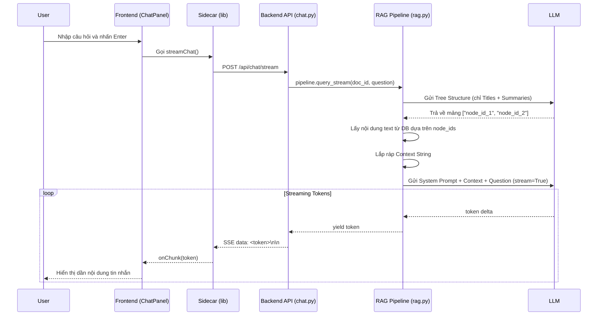

# Tài liệu Kiến trúc và Triển khai: Tính năng Chat với Document

Tài liệu này mô tả chi tiết logic hoạt động của tính năng Chat với Document, từ khi người dùng nhập câu hỏi trên giao diện cho đến khi AI trả về kết quả.

## 1. Tổng quan Luồng xử lý (Workflow)



---

## 2. Chi tiết Triển khai và Code

### 2.1. Frontend - Giao diện và Bắt sự kiện
- **File**: `src/components/ChatPanel.tsx`
- **Logic**:
  - `ChatPanel` là giao diện chính hiển thị cuộc hội thoại. State `messages` lưu trữ toàn bộ lịch sử tin nhắn của lần mở hiện tại.
  - Khi user nhấn Enter, hàm `sendMessage` được gọi. Hàm này sẽ:
    1. Lấy nội dung từ `input`, thêm 1 `userMsg` vào state.
    2. Khởi tạo một `assistantMsg` trống, đánh dấu cờ `streaming: true` để render hiệu ứng con trỏ nhấp nháy.
    3. Gọi API thông qua `streamChat`. Bất cứ khi nào nhận được token mới từ backend, nó sẽ update state và append nội dung vào `assistantMsg`.

- **File**: `src/lib/sidecar.ts`
- **Logic**:
  - Hàm `streamChat(docId, question, onChunk)` khởi tạo một request `fetch` HTTP POST đến endpoint `http://localhost:8008/api/chat/stream`.
  - Khi response trả về, hàm sử dụng `reader.read()` từ `res.body.getReader()` để đọc luồng dữ liệu Server-Sent Events (SSE).
  - Nó tiến hành bóc tách tiền tố `data: ` để lấy chuỗi payload, chuyển đổi các escape character `\n` (từ JSON string) thành ký tự xuống dòng thực tế, bỏ qua khi gặp cờ kết thúc `[DONE]` và báo lỗi nếu gặp chuỗi `[ERROR]`. Cuối cùng gọi callback `onChunk(text)` cho từng cụm từ mới.

### 2.2. Backend - API Endpoint (Xử lý SSE)
- **File**: `backend/api/chat.py`
- **Logic**:
  - Khai báo endpoint `@router.post("/stream")` nhận payload gồm `doc_id` và `question`.
  - Khởi tạo generator `_event_generator()` để duyệt (iterate) qua luồng async generator `pipeline.query_stream`.
  - Chuẩn hóa các tokens sang định dạng chuẩn của SSE: `yield f"data: {escaped}\n\n"`. Token được `replace("\n", "\\n")` để đảm bảo tín hiệu SSE không bị ngắt quãng dòng sai.
  - Endpoint sử dụng lớp `StreamingResponse` của FastAPI kèm headers `"Content-Type": "text/event-stream"` và `"Cache-Control": "no-cache"` để stream trực tiếp về client.

### 2.3. Backend - RAG Pipeline (Retrieval và Logic Sinh Prompt)
- **File**: `backend/services/rag.py`
- **Logic**: Backend sử dụng phương pháp **Tree Reasoning Retrieval** (Retrieval hai bước sử dụng cấu trúc cây) thông qua lớp `RAGPipeline`. Toàn bộ quá trình nằm trong hàm `_get_context`.

#### Bước 1: Retrieve - Chọn Node dựa trên Cấu trúc
- Backend lấy `tree_index` (JSON mục lục sinh bởi Docling / Converter) từ CSDL SQLite.
- Thay vì ném toàn bộ text vào RAG, hệ thống gửi một "cấu trúc không có text" (`structure_no_text` gồm tiêu đề, tóm tắt và `node_id`) của văn bản cho LLM thông qua hàm `_select_nodes_sync`.
- **Prompt lấy mục lục (`_NODE_SELECT_PROMPT`)**:
  ```text
  Given this document's tree structure, identify which sections are most relevant to answer the user's question. Return ONLY a JSON array of node_ids, ordered by relevance. Select 1-5 nodes maximum.
  
  Document Structure: {structure}
  Question: {question}
  ```
- LLM sẽ phân tích mục lục và trả về mảng các `node_id` cần thiết (ví dụ: `["001", "003"]`). Việc này giúp đảm bảo sự tập trung tuyệt đối của ngữ cảnh trả về và tiết kiệm Token, đồng thời không bị nhiễu thông tin.

#### Bước 2: Truy xuất Context Text
- Từ mảng `node_ids`, backend gọi `find_nodes_by_ids` để lấy lại nội dung text dài chi tiết của các node đó.
- Hàm `_build_context_from_nodes` ghép các khối văn bản này lại cùng với tiêu đề section, tạo ra một biến `context` dạng String. Nếu nội dung vượt quá 12.000 ký tự (`MAX_CONTEXT_CHARS`), nó sẽ tự động bị cắt đi để tránh lỗi Context Limit.
- **Fallback**: Nếu văn bản nào đó không có `tree_index`, hệ thống sẽ fallback đọc toàn bộ raw markdown nội dung `_get_document_content()` và lấy max 12.000 ký tự đầu tiên.

#### Bước 3: Build Prompt Cuối cùng và Streaming 
- Hàm `query_stream` được sử dụng để bắt đầu stream tới LLM thông qua AsyncGenerator.
- **Prompt hệ thống (`_SYSTEM_PROMPT`)** ép buộc LLM tuân thủ RAG nghiêm ngặt:
  1. Chỉ lấy thông tin trong Document Context được cung cấp.
  2. Nếu không có đủ thông tin, thông báo rõ ràng là không tìm thấy.
  3. Trích dẫn đúng tên Section.
  4. Trả lời ngắn gọn, có cấu trúc.
  5. Không ảo giác (hallucinate).
- Cấu trúc messages gửi đi tới LLM:
  ```python
  messages = [
      {"role": "system", "content": _SYSTEM_PROMPT},
      {"role": "user", "content": f"Document context:\n\n{context}\n\nQuestion: {question}"},
  ]
  ```
- Gọi LLM với tham số `stream=True` và yield từng token delta (`chunk.choices[0].delta.content`) cho tới khi kết thúc.
