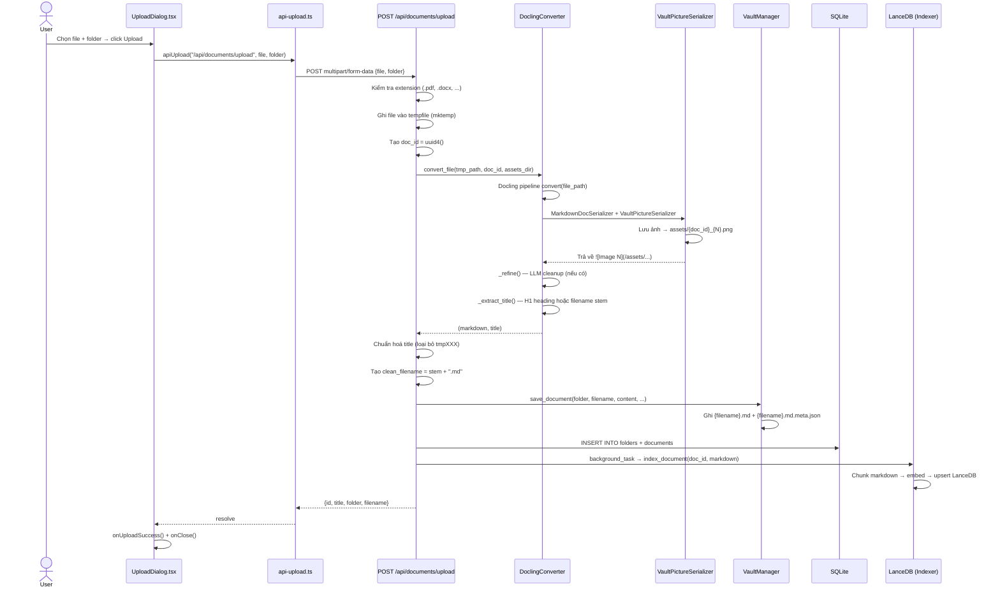

# 🔍 Logic Review: Luồng Upload File — LAIDocs

> [!NOTE]
> **This review was written before the PageIndex migration.** The upload flow has changed: LanceDB vector indexing and FTS5 have been replaced by PageIndex tree index building. See [page_index_code_review.md](page_index_code_review.md) for the current architecture. The conversion pipeline (Docling → Markdown) described here remains accurate.

## Sơ đồ tổng quan



---

## Phân tích từng tầng

### 1. Frontend — `UploadDialog.tsx`

| Điểm | Đánh giá |
|------|-----------|
| `useEffect` reset state khi `open` thay đổi | ✅ Đúng — tránh state cũ khi mở lại dialog |
| `initialFolder` được dùng để pre-fill folder select | ✅ Đã fix từ conversation trước |
| Sau upload thành công: `onUploadSuccess()` + `onClose()` | ✅ Đúng thứ tự |
| Không hiển thị `success` message (set nhưng không dùng sau `onClose`) | ⚠️ `setSuccess("")` xảy ra trước khi `onClose`, nên success message không bao giờ visible vì `onClose` ẩn dialog ngay |
| Chỉ upload file đầu tiên từ drop zone | ℹ️ Thiết kế đơn giản, hợp lý |
| Error message hiển thị trong dialog | ✅ Tốt |
| `uploading` state chặn nút upload | ✅ Đúng |

---

### 2. HTTP Transport — `api-upload.ts`

| Điểm | Đánh giá |
|------|-----------|
| Dùng `FormData` thay JSON | ✅ Bắt buộc với multipart upload |
| Không set `Content-Type` header | ✅ **Đúng** — Browser tự set boundary khi dùng FormData |
| Error handling: parse body text | ✅ Chi tiết, hiển thị message từ server |
| Return type generic `T` nhưng không được dùng ở UploadDialog | ⚠️ `handleUpload` bỏ qua response, không dùng `id`/`title` trả về |

---

### 3. API Endpoint — `POST /api/documents/upload`

**Luồng chính:**

```
Validate ext → tempfile → uuid4() → convert → fixup title → save vault → SQLite → background LanceDB
```

| Điểm | Đánh giá |
|------|-----------|
| Extension validation đầy đủ | ✅ 8 loại được phép |
| `doc_id = uuid4()` tạo **trước** convert | ✅ Quan trọng — đảm bảo image filenames consistent (`doc_id_N.png`) |
| `tempfile.NamedTemporaryFile(delete=False)` | ✅ Cần `delete=False` để converter đọc được sau khi `with` block kết thúc |
| `os.unlink(tmp_path)` trong `finally` | ✅ Cleanup đúng chỗ |
| Title fixup: loại `tmp*` prefix | ✅ Đã xử lý tốt |
| `folder or "unsorted"` fallback | ✅ Đúng |
| **LanceDB index trong `background_tasks`** | ✅ Non-blocking, không làm chậm response |
| Không await background task | ℹ️ Đây là trade-off đúng đắn — indexing không nên block upload |
| **Exception: toàn bộ bọc trong `try/except Exception`** | ⚠️ Nếu `vault.save_document` thành công nhưng SQLite INSERT lỗi → file saved nhưng không indexed; không rollback |

---

### 4. Conversion Layer — `DoclingConverter` + `VaultPictureSerializer`

| Điểm | Đánh giá |
|------|-----------|
| Lazy init converter (singleton) | ✅ Tránh load model mỗi request |
| `ConversionStatus.SUCCESS` check | ✅ Fail fast nếu Docling lỗi |
| `VaultPictureSerializer` lưu PNG → `/vault/assets/` | ✅ Tốt |
| Image URL: `/assets/{doc_id}_{N}.png` | ✅ Phù hợp với StaticFiles mount |
| `_refine()` LLM fallback graceful | ✅ Không crash nếu không có LLM |
| `_extract_title()` từ H1 hoặc filename stem | ✅ Đúng ý nghĩa |
| `MarkdownParams(image_mode=ImageRefMode.PLACEHOLDER)` | ⚠️ PLACEHOLDER mode có thể khiến Docling **không** gọi `VaultPictureSerializer.serialize()` trực tiếp — cần kiểm tra lại xem images có thực sự được lưu không |

---

### 5. Vault Storage — `VaultManager`

| Điểm | Đánh giá |
|------|-----------|
| Lưu 2 files: `.md` + `.md.meta.json` | ✅ Đơn giản, filesystem-native |
| `get_document()` dùng `rglob("*.meta.json")` | ⚠️ **O(n) full-scan** toàn bộ vault mỗi lần GET — sẽ chậm khi có nhiều tài liệu |
| `doc_id` là UUID trong meta.json | ✅ Stable identifier |
| `.with_suffix("").with_suffix("")` để dereference meta path | ⚠️ Fragile với multi-dot filenames vd: `my.doc.md.meta.json` → sau 2 lần `with_suffix("")` thành `my.doc` thay vì `my.doc.md` |

---

### 6. SQLite Indexing — `database.py` (qua documents.py)

| Điểm | Đánh giá |
|------|-----------|
| `INSERT OR IGNORE` cho folders | ✅ Idempotent |
| `INSERT OR REPLACE` cho documents | ✅ Đúng — upsert semantics |
| Content đầy đủ được lưu vào SQLite | ✅ Phục vụ FTS5 |
| Không có transaction bao quanh cả save_document + SQL | ⚠️ Nếu SQL INSERT lỗi sau khi vault file đã ghi → dữ liệu không nhất quán |

---

### 7. Vector Indexing — `Indexer` (LanceDB)

| Điểm | Đánh giá |
|------|-----------|
| Background task → non-blocking | ✅ |
| Chunking 3 cấp: heading → paragraph → sentence | ✅ Semantic chunking tốt |
| Overlap 300 chars | ✅ Giúp context không bị mất ở biên |
| `_delete_from_lance()` trước khi add | ✅ Tránh duplicate chunks |
| Graceful skip nếu embedding không configured | ✅ |
| Exception trong `_delete_from_lance` bị silently swallowed | ⚠️ `except Exception: pass` — khó debug nếu xảy ra lỗi thực |

---

## Tóm tắt vấn đề tiềm ẩn

| # | Severity | Layer | Vấn đề |
|---|----------|-------|---------|
| 1 | 🟡 Medium | `vault.py` | `get_document()` O(n) full-scan với `rglob` — cần index hoặc SQLite lookup |
| 2 | 🟡 Medium | `documents.py` | Không có transaction bao quanh vault write + SQLite — risk inconsistency |
| 3 | 🟡 Medium | `converter.py` | `ImageRefMode.PLACEHOLDER` có thể không trigger `VaultPictureSerializer.serialize()` — cần verify |
| 4 | 🟠 Low | `vault.py` | `.with_suffix("").with_suffix("")` dereference fragile với multi-dot filenames |
| 5 | 🟠 Low | `UploadDialog.tsx` | `success` state được set nhưng dialog đóng ngay → user không thấy message |
| 6 | 🟠 Low | `indexer.py` | `except Exception: pass` trong `_delete_from_lance` — silent failure |
| 7 | 🔵 Info | `api-upload.ts` | Response body (`{id, title}`) không được dùng → lost opportunity cho optimistic update |

---

## Điểm mạnh của thiết kế

- ✅ **UUID pre-allocation trước convert** — đảm bảo image-document ID consistency
- ✅ **Background indexing** — upload không block vì LanceDB embed
- ✅ **Graceful degradation** toàn hệ thống: không có LLM → vẫn chạy, không có embedding → FTS-only
- ✅ **Singleton lazy-init** converter — tránh cold start penalty
- ✅ **Cleanup tempfile** trong `finally` — không rò rỉ disk
- ✅ **Filesystem + SQLite dual storage** — vault là source of truth, SQLite phục vụ FTS
